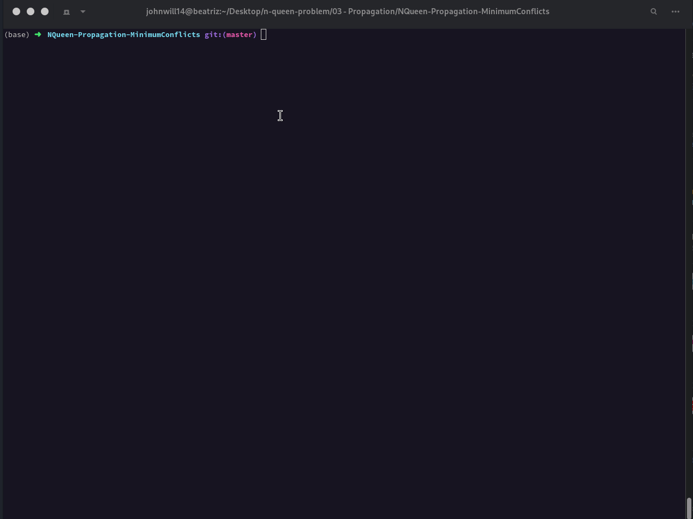
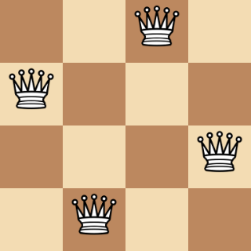
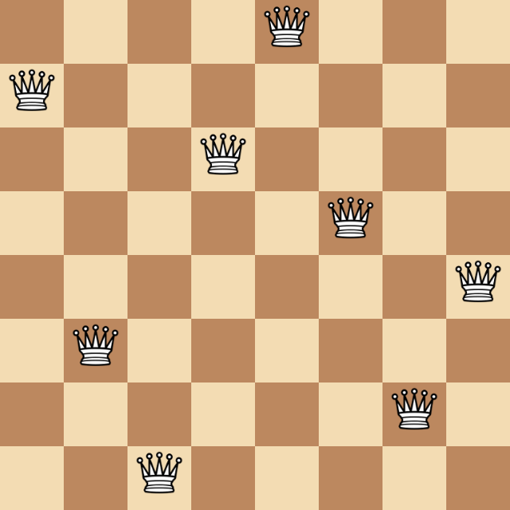
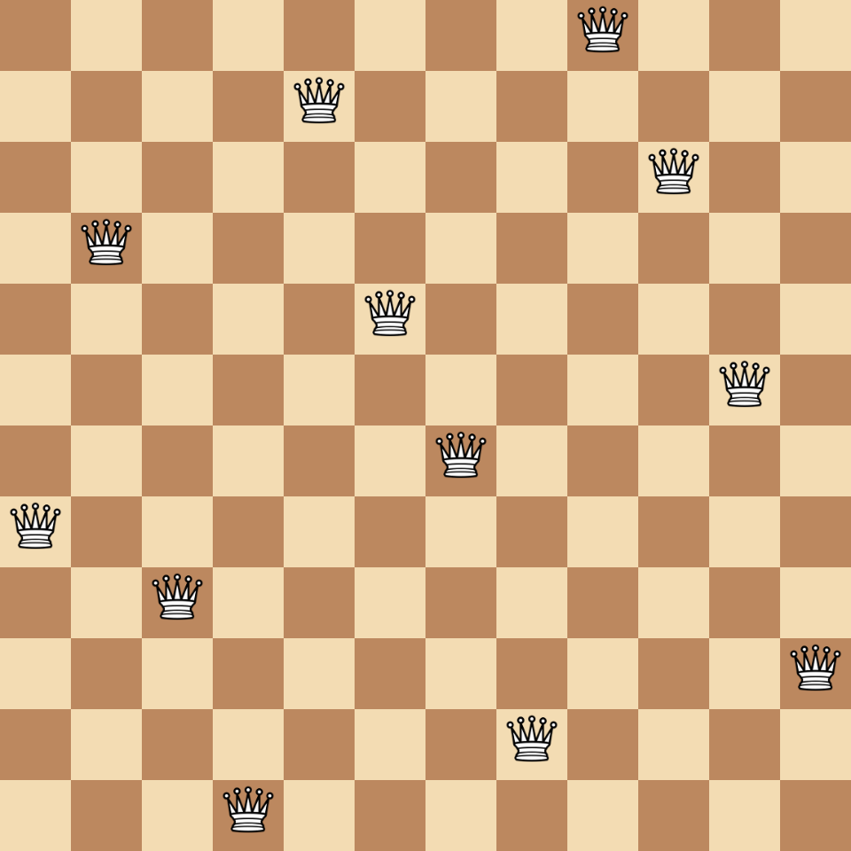
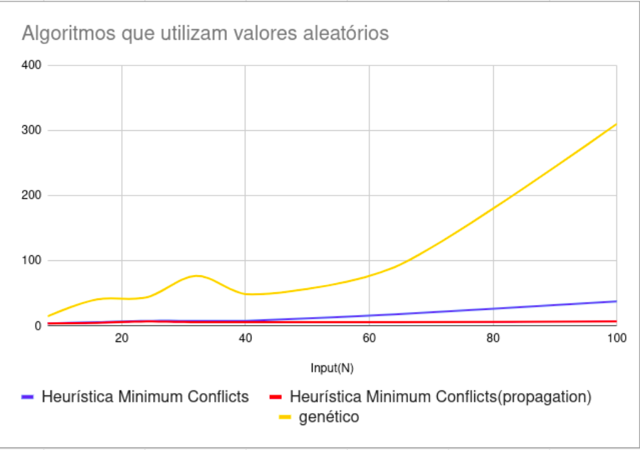
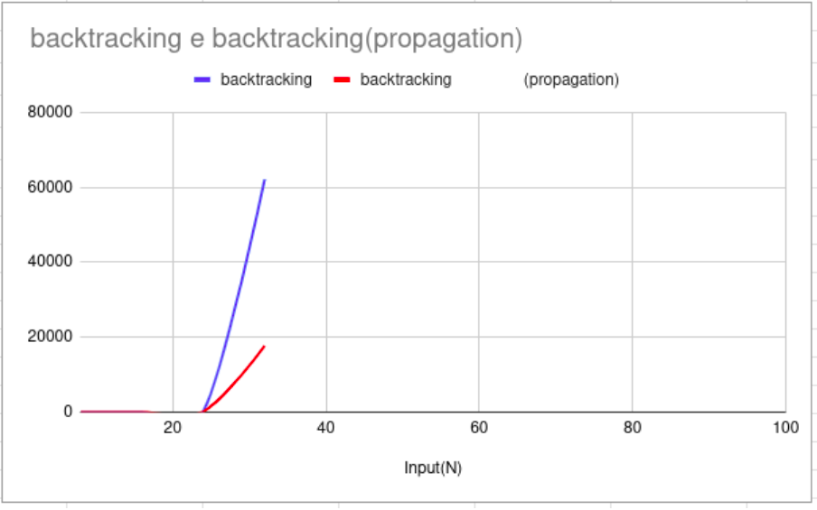

     

#        N-Queen Problem

Algoritimos implementados:
 * Backtracking
 * Minimum Conflicts
 * Propagation
 * Genetic


## Como executar

  ### Java
  É necessário possuir a versão 17 do JAVA ou superior.
  
  Entre nas pastas dos projetos e execute o seguinte comando no terminal:

  ```bash
  ./gradlew run --console=plain
  ```

  Insira o valor n contendo o número para o problema do n rainhas:


  
  
  
## Analisar soluções encontradas

  Na pasta ```board-htm``` ao acessar o arquivo index.html é possível submeter uma solução do problema, no formato de json, e dessa maneira gerar uma melhor visualização das posições das rainhas:








# Resultados

<p>
Essa seção traz um resumo dos casos de testes que foram utilizados para cada um dos algoritmos, a fim de estabelecer um comparativo gráfico das soluções encontradas. Lembrando que algoritmos que abordagens aleatórias são mais difíceis de realizar um comparativo, devido a isso os valores presentes são apenas dos testes feitos em um notebook com sistema operacional Linux e cpu AMD Ryzen™ 7 5800H with Radeon™ Graphics × 16.

</p>

<table>
<tbody>
<tr>
<td rowspan="2">Input(N)</td>
<td colspan="5">
<p><span style="font-weight: 400;">Tempo em milissegundos</span></p>
</td>
</tr>
<tr>

<td>
<p><span style="font-weight: 400;">backtracking</span></p>
</td>
<td>
<p><span style="font-weight: 400;">Heur&iacute;stica Minimum Conflicts</span></p>
</td>
<td>
<p><span style="font-weight: 400;">backtracking (propagation)</span></p>
</td>
<td>
<p><span style="font-weight: 400;">Heur&iacute;stica Minimum Conflicts</span></p>
<p><span style="font-weight: 400;">(propagation)</span></p>
</td>
<td>
<p><span style="font-weight: 400;">gen&eacute;tico</span></p>
</td>
</tr>
<tr>
<td>
<p><span style="font-weight: 400;">8</span></p>
</td>
<td>
<p><span style="font-weight: 400;">1</span></p>
</td>
<td>
<p><span style="font-weight: 400;">4</span></p>
</td>
<td>
<p><span style="font-weight: 400;">0</span></p>
</td>
<td>
<p><span style="font-weight: 400;">4</span></p>
</td>
<td>
<p><span style="font-weight: 400;">15</span></p>
</td>
</tr>
<tr>
<td>
<p><span style="font-weight: 400;">16</span></p>
</td>
<td>
<p><span style="font-weight: 400;">19</span></p>
</td>
<td>
<p><span style="font-weight: 400;">6</span></p>
</td>
<td>
<p><span style="font-weight: 400;">6</span></p>
</td>
<td>
<p><span style="font-weight: 400;">5</span></p>
</td>
<td>
<p><span style="font-weight: 400;">41</span></p>
</td>
</tr>
<tr>
<td>
<p><span style="font-weight: 400;">24</span></p>
</td>
<td>
<p><span style="font-weight: 400;">204</span></p>
</td>
<td>
<p><span style="font-weight: 400;">8</span></p>
</td>
<td>
<p><span style="font-weight: 400;">158</span></p>
</td>
<td>
<p><span style="font-weight: 400;">7</span></p>
</td>
<td>
<p><span style="font-weight: 400;">44</span></p>
</td>
</tr>
<tr>
<td>
<p><span style="font-weight: 400;">32</span></p>
</td>
<td>
<p><span style="font-weight: 400;">62101</span></p>
</td>
<td>
<p><span style="font-weight: 400;">8</span></p>
</td>
<td>
<p><span style="font-weight: 400;">17661</span></p>
</td>
<td>
<p><span style="font-weight: 400;">6</span></p>
</td>
<td>
<p><span style="font-weight: 400;">77</span></p>
</td>
</tr>
<tr>
<td>
<p><span style="font-weight: 400;">40</span></p>
</td>
<td>
<p><span style="font-weight: 400;">7200000</span></p>
</td>
<td>
<p><span style="font-weight: 400;">8</span></p>
</td>
<td>
<p><span style="font-weight: 400;">7200000</span></p>
</td>
<td>
<p><span style="font-weight: 400;">6</span></p>
</td>
<td>
<p><span style="font-weight: 400;">49</span></p>
</td>
</tr>
<tr>
<td>
<p><span style="font-weight: 400;">64</span></p>
</td>
<td>
<p><span style="font-weight: 400;">-</span></p>
</td>
<td>
<p><span style="font-weight: 400;">18</span></p>
</td>
<td>
<p><span style="font-weight: 400;">-</span></p>
</td>
<td>
<p><span style="font-weight: 400;">6</span></p>
</td>
<td>
<p><span style="font-weight: 400;">90</span></p>
</td>
</tr>
<tr>
<td>
<p><span style="font-weight: 400;">100</span></p>
</td>
<td>
<p><span style="font-weight: 400;">-</span></p>
</td>
<td>
<p><span style="font-weight: 400;">38</span></p>
</td>
<td>
<p><span style="font-weight: 400;">-</span></p>
</td>
<td>
<p><span style="font-weight: 400;">7</span></p>
</td>
<td>
<p><span style="font-weight: 400;">310</span></p>
</td>
</tr>
</tbody>
</table>






<br/>
<br/>
<br/>
<br/>
<br/>


